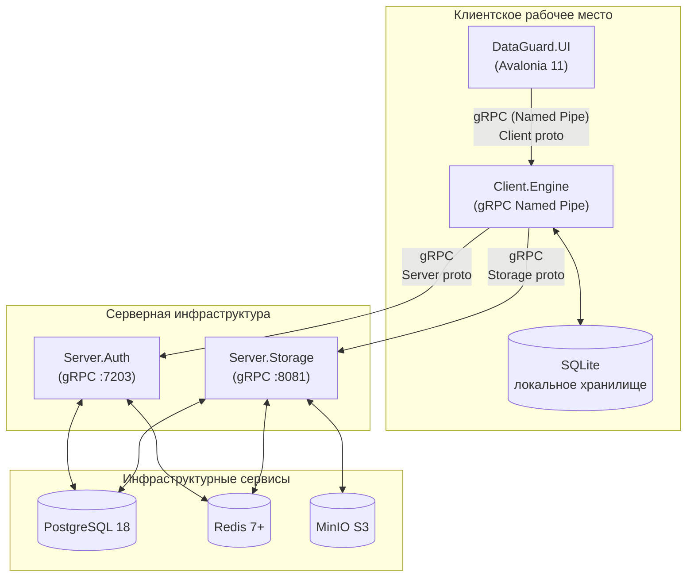
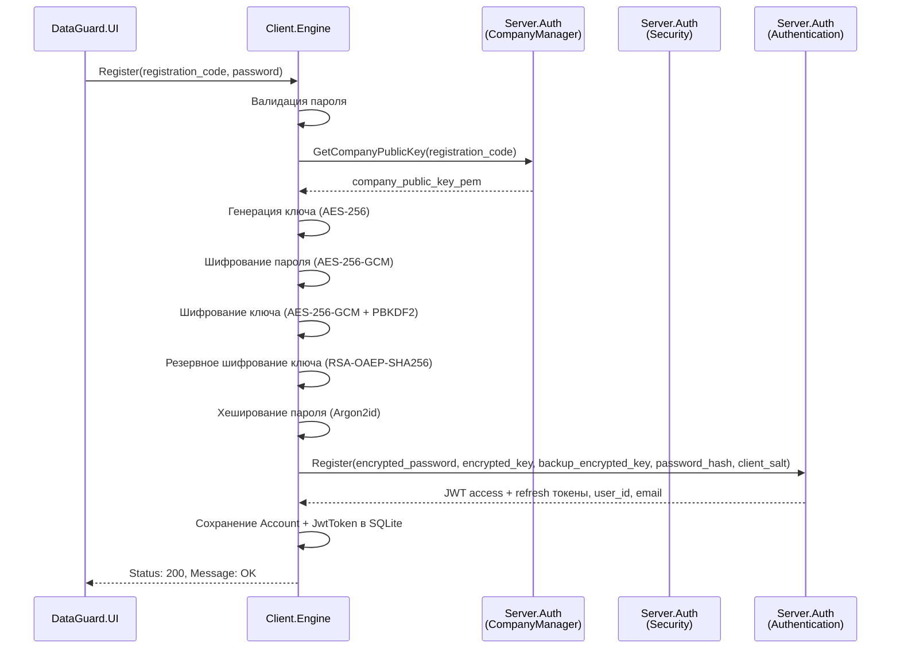
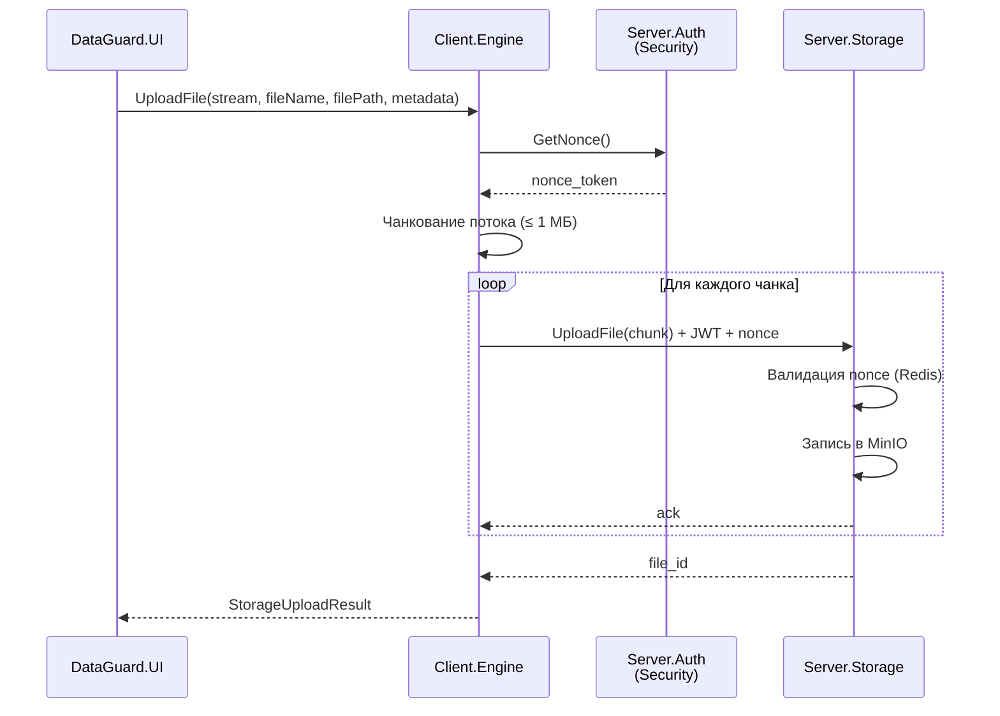

# Архитектурный обзор DataGuard

## 1. Назначение системы

**DataGuard** — распределённая корпоративная система управления файловым хранилищем с сквозным клиентским шифрованием. Система обеспечивает аутентификацию пользователей, управление организациями (компаниями) и группами, а также безопасное хранение файлов с поддержкой разграничения доступа на уровне файлов и директорий.

Ключевое свойство архитектуры — **сервер не имеет доступа к расшифрованному содержимому файлов пользователя**. Шифрование и дешифрование выполняются исключительно на стороне клиента (в Client.Engine).

---

## 2. Архитектурный стиль

DataGuard реализован в соответствии с паттерном **модульный монолит на уровне сервисов**, где каждый сервис является самостоятельным ASP.NET Core приложением, взаимодействующим через gRPC:

| Уровень | Модуль | Назначение |
|:---|:---|:---|
| **Клиент (Presentation)** | DataGuard.UI | Десктопный GUI на базе Avalonia 11 |
| **Клиентский движок (Client Engine)** | Client.Engine | Промежуточный слой: криптография, проксирование, локальное хранение |
| **Сервер аутентификации** | Server.Auth | Управление пользователями, компаниями, группами, JWT |
| **Сервер хранилища** | Server.Storage | Файловое хранилище, метаданные, ссылки |
| **Общие контракты** | Contracts | Protobuf-определения (gRPC) |
| **Общие модели** | Common | Доменные сущности, вспомогательные классы |

---

## 3. Схема взаимодействия компонентов



### Путь запроса: регистрация пользователя



### Путь запроса: загрузка файла



---

## 4. Структура решения

```
DataGuard/
├── Server.Auth/                     # Сервер аутентификации
│   ├── Controllers/                 # REST API контроллеры
│   ├── Middlewares/                 # JwtMiddleware
│   ├── Migrations/                  # EF Core миграции (PostgreSQL)
│   ├── Models/                      # RegistrationData (Redis-сериализуемая модель)
│   ├── Options/                     # Классы конфигурации (IOptions<T>)
│   │   ├── JwtOptions.cs
│   │   ├── SecurityOptions.cs
│   │   └── CompanyManagerOptions.cs
│   ├── Services/                    # Реализация бизнес-логики
│   │   ├── AuthenticationService.cs  # gRPC: Register, Login, RefreshToken, CreateRegistrationCode
│   │   ├── CompanyManagerService.cs  # gRPC: CreateCompany, Get/SetCompanyPublicKey
│   │   ├── SecurityRequestsService.cs # gRPC: GetNonce, GetSalt
│   │   ├── JwtService.cs            # Генерация, верификация, отзыв JWT
│   │   ├── SecurityService.cs       # Nonce-токены, Argon2id, генерация соли
│   │   ├── DataBaseService.cs       # DbContext (PostgreSQL)
│   │   └── UserAccessor.cs          # DI-scoped хранитель текущего пользователя
│   ├── Interfaces/                  # IJwtService, ISecurityService
│   └── Program.cs
│
├── Server.Storage/                  # Сервер файлового хранилища
│   ├── Controllers/                 # REST: StorageLinksController (скачивание по ссылкам)
│   ├── Data/                        # StorageDbContext
│   ├── Migrations/                  # EF Core миграции (PostgreSQL)
│   ├── Models/                      # Доменные сущности хранилища
│   │   ├── StorageFile.cs
│   │   ├── StorageDirectory.cs
│   │   ├── StorageNonce.cs
│   │   ├── StorageSharedLink.cs
│   │   ├── FileMetadataEntry.cs
│   │   ├── StorageFileAccess.cs
│   │   └── StorageAccessLevel.cs
│   ├── Interfaces/                  # Абстракции инфраструктурных сервисов
│   │   ├── IStorageFileRepository.cs
│   │   ├── IStorageDirectoryRepository.cs
│   │   ├── IStorageBlobStore.cs
│   │   ├── IStorageNonceService.cs
│   │   ├── IStorageMetadataService.cs
│   │   ├── IStorageLinkService.cs
│   │   ├── IStoragePathValidator.cs
│   │   └── IOwnerIdentityProvider.cs
│   ├── Services/                    # Реализация сервисов
│   │   ├── StorageGrpcService.cs    # 21 gRPC-метод
│   │   ├── StorageFileRepository.cs
│   │   ├── StorageDirectoryRepository.cs
│   │   ├── MinioBlobStore.cs        # Интеграция с MinIO S3
│   │   ├── StorageNonceService.cs   # Redis nonce
│   │   ├── StorageMetadataService.cs
│   │   ├── StorageLinkService.cs    # Генерация ссылок (Nanoid)
│   │   ├── StoragePathValidator.cs
│   │   └── JwtOwnerIdentityProvider.cs
│   └── Program.cs
│
├── Client.Engine/                   # Клиентский движок (Background Worker + gRPC-сервер)
│   ├── Helpers/
│   │   ├── SecurityHelper.cs        # AES-256-GCM, PBKDF2, Argon2id, RSA-OAEP
│   │   ├── AuthenticationHelper.cs
│   │   └── StorageValidationHelper.cs
│   ├── Services/
│   │   ├── AuthenticationService.cs  # Прокси: клиентская криптография → Server.Auth
│   │   ├── CompanyManagerService.cs  # Прокси → Server.Auth (CompanyManager)
│   │   ├── StorageClientService.cs   # Прокси: 21 метод → Server.Storage
│   │   ├── DataBaseService.cs        # SQLite DbContext
│   │   ├── JwtTokenProvider.cs       # Хранение и управление JWT
│   │   ├── KeyProvider.cs            # Хранение symmetric key в памяти
│   │   └── UserAgentProvider.cs      # User-Agent заголовок
│   ├── Workers/
│   │   └── ConsoleCommandWorker.cs   # Консольные команды для отладки
│   ├── Models/                      # Account, JwtToken, StorageModels
│   ├── Options/                     # SecurityOptions (клиентские параметры)
│   ├── Interfaces/                  # IStorageService, IJwtTokenProvider и др.
│   └── Program.cs                   # Named Pipe (DataGuardPipe), gRPC-сервер
│
├── DataGuard.UI/                    # Десктопный GUI (Avalonia 11)
│   ├── Assets/                      # Стили, шрифты, иконки
│   ├── Models/                      # DataModels.cs (UI-модели)
│   ├── Services/
│   │   └── GrpcClientService.cs     # Обёртка над gRPC-каналом
│   ├── ViewModels/                  # MVVM: MainWindowViewModel, AuthViewModels, FeatureViewModels
│   ├── Views/                       # AXAML-представления
│   └── Protos/                      # Локальные копии proto-контрактов
│
├── Contracts/                       # Общие Protobuf-контракты
│   └── Protos/
│       ├── auth.proto               # Серверный контракт аутентификации
│       ├── security.proto            # Серверный контракт безопасности (nonce, salt)
│       ├── company_manager.proto     # Серверный контракт управления компаниями
│       ├── storage.proto             # Контракт файлового хранилища (21 RPC)
│       └── Client/
│           ├── auth.proto            # Клиентский контракт аутентификации
│           └── company_manager.proto  # Клиентский контракт управления компаниями
│
├── Common/                          # Общие модели и утилиты
│   ├── Helpers/
│   │   └── JwtHelper.cs             # Extension-методы для JwtSecurityToken
│   └── Server/Models/
│       ├── User.cs                  # identity.users
│       ├── UserJWT.cs              # identity.UserJwtRefreshTokens
│       ├── Company.cs              # identity.companies
│       ├── Group.cs                # identity.groups + GroupMember + GroupRole
│       └── Icon.cs                 # identity.icons
│
├── docker-compose.yml               # PostgreSQL 18, Redis, MinIO
└── DataGuard.slnx                   # Solution-файл
```

---

## 5. Протоколы взаимодействия

### 5.1. GUI ↔ Client.Engine

- **Транспорт:** Named Pipe (`DataGuardPipe`), протокол HTTP/2
- **Протокол:** gRPC с клиентскими контрактами (`Contracts/Protos/Client/`)
- **Особенность:** Клиентские proto-контракты используют упрощённые типы (пароль как `string`), криптография выполняется внутри Client.Engine

### 5.2. Client.Engine ↔ Server.Auth / Server.Storage

- **Транспорт:** HTTPS (gRPC over HTTP/2)
- **Протокол:** gRPC с серверными контрактами (`Contracts/Protos/`)
- **Порты:** Server.Auth — `:7203`, Server.Storage — `:8081`

### 5.3. Server.Storage — REST (ссылки на скачивание)

- **Транспорт:** HTTPS
- **Протокол:** REST API (2 endpoint)
- **Назначение:** Скачивание файлов по одноразовым и прямым ссылкам без JWT

---

## 6. Аутентификация и авторизация

### 6.1. Модель аутентификации

DataGuard использует двухуровневую схему аутентификации:

1. **Клиентская криптография (Client.Engine):**
   - Пароль хешируется с помощью Argon2id с клиентской солью (256 бит)
   - Пароль шифруется AES-256-GCM для хранения на сервере
   - Случайный symmetric key (256 бит) шифруется паролем (PBKDF2 + AES-256-GCM)
   - Резервная копия ключа шифруется публичным RSA-ключом компании (OAEP-SHA256)

2. **Серверная аутентификация (Server.Auth):**
   - JWT Access-токен (по умолчанию — 30 минут) и Refresh-токен (24 часа)
   - Алгоритм подписи: HMAC-SHA256
   - Nonce-токены (HMAC-SHA256 подпись + Redis, TTL 5 минут) для защиты от повторных атак
   - Отзыв токенов: Access — через Redis (чёрный список), Refresh — через удаление из PostgreSQL

### 6.2. Сравнение паролей

Все криптографические сравнения выполняются с использованием `CryptographicOperations.FixedTimeEquals` для предотвращения timing-атак.

### 6.3. Авторизация в Server.Storage

- JWT Bearer аутентификация через стандартный ASP.NET Core middleware
- Идентификация владельца (owner) — через парсинг `sub`-claim из JWT
- Nonce-токены (Redis, TTL 5 минут) требуются для всех изменяющих операций (upload, delete, move, copy, rename, update, generate link)

---

## 7. Инфраструктурные сервисы

| Сервис | Версия | Порт | Назначение |
|:---|:---|:---|:---|
| PostgreSQL | 18 | 5432 | Реляционная СУБД для Server.Auth и Server.Storage |
| Redis | latest | 6379 | Nonce-токены, чёрный список JWT, данные регистрации |
| MinIO | latest | 9000 (API), 9001 (консоль) | S3-совместимое blob-хранилище для файлов |