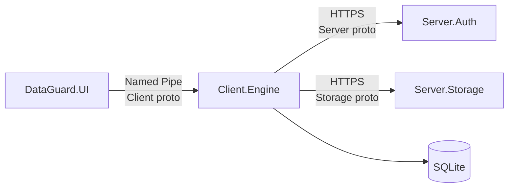
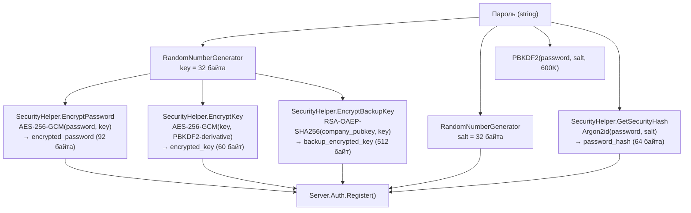

# Client.Engine — Клиентский движок

## Обзор

**Client.Engine** — фоновый процесс (Background Worker) и одновременно gRPC-сервер, выполняющий роль промежуточного слоя между графическим интерфейсом (DataGuard.UI) и серверами DataGuard. Отвечает за выполнение клиентской криптографии, проксирование запросов и локальное хранение данных аутентификации.

**Технологии:**
- ASP.NET Core gRPC 2.80.0 (сервер для GUI)
- Grpc.Net.ClientFactory 2.80.0 (клиент к серверам)
- Entity Framework Core 10.0.9 + SQLite (локальное хранение)
- Konscious.Security.Cryptography.Argon2 1.3.1
- System.Security.Cryptography (AES-256-GCM, RSA-OAEP-SHA256, PBKDF2, HMAC-SHA256)

**Транспорт для GUI:** Named Pipe `DataGuardPipe`, протокол HTTP/2

---

## Конфигурация

### appsettings.json

| Секция | Ключ | Значение по умолчанию | Описание |
|:---|:---|:---|:---|
| `Grpc` | `AuthUrl` | `https://localhost:7203` | URL Server.Auth |
| `Grpc` | `CompanyManagerUrl` | `https://localhost:7203` | URL Server.Auth (CompanyManager endpoint) |
| `Grpc` | `SecurityUrl` | `https://localhost:7203` | URL Server.Auth (Security endpoint) |
| `Grpc` | `StorageUrl` | `https://localhost:8081` | URL Server.Storage |
| `Security` | `SaltLength` | 32 | Длина соли (256 бит) |
| `Security` | `HashLength` | 32 | Длина хеша (256 бит) |
| `Security` | `HashIterations` | 600 000 | Итерации PBKDF2 |
| `Security` | `NonceLength` | 12 | Длина nonce AES-GCM (96 бит) |
| `Security` | `TagLength` | 16 | Длина тега AES-GCM (128 бит) |
| `Security` | `MasterKeySalt` | — | Соль мастер-ключа (env var) |
| `Security` | `KeyLength` | 32 | Длина symmetric key (256 бит) |
| `Security` | `RsaKeySize` | 4096 | Размер RSA-ключа компании (бит) |
| `Security` | `Password:MinimumLength` | 8 | Минимальная длина пароля |
| `Security` | `Password:MaximumLength` | 21 | Максимальная длина пароля |
| `Security` | `Password:EncryptedLength` | 64 | Длина шифрованного пароля (512 бит) |
| `Security` | `Argon2:DegreeOfParallelism` | 1 | Параллелизм Argon2id |
| `Security` | `Argon2:Iterations` | 3 | Итерации Argon2id |
| `Security` | `Argon2:MemorySize` | 19456 | Объём памяти Argon2id (19 МБ) |

---

## Архитектура

Client.Engine одновременно является:
1. **gRPC-сервером** — принимает запросы от DataGuard.UI через Named Pipe
2. **gRPC-клиентом** — перенаправляет запросы на Server.Auth и Server.Storage через HTTPS

### Ключевое отличие proto-контрактов

Клиентские proto-контракты (`Contracts/Protos/Client/`) используют упрощённые типы:

| Операция | Клиентский контракт | Серверный контракт |
|:---|:---|:---|
| Register | `password: string` | `encrypted_password: bytes`, `encrypted_key: bytes`, `password_hash: bytes`, `client_salt: bytes`, `backup_encrypted_key: bytes` |
| Login | `password: string` | `password_hash: bytes`, `nonce_token: string` |

Client.Engine принимает простой пароль от GUI и выполняет полную криптографическую подготовку перед отправкой на сервер.

---

## Сервисы

### 1. AuthenticationService

**Реализация:** `Client.Engine/Services/AuthenticationService.cs`
**gRPC-контракт:** `Contracts/Protos/Client/auth.proto`
**Область видимости:** Scoped

Выполняет криптографическую подготовку данных аутентификации и проксирует запросы на Server.Auth.

#### Register

**Параметры запроса (от GUI):**

| Поле | Тип | Описание |
|:---|:---|:---|
| `registration_code` | string | Код регистрации (12 символов, `[A-Za-z0-9]`) |
| `password` | string | Пароль пользователя (от 8 до 21 символа) |
| `company_public_key_pem` | string (optional) | RSA-4096 публичный ключ компании (если GUI его сгенерировал) |

**Валидация пароля (на клиенте):**

| Правило | Сообщение |
|:---|:---|
| Длина < 8 | Password too short |
| Длина > 21 | Password too long |
| Содержит пробелы | Password cannot contain whitespace |
| Нет заглавной буквы | Password must contain at least one uppercase letter |
| Нет строчной буквы | Password must contain at least one lowercase letter |
| Нет цифры | Password must contain at least one digit |
| Нет специального символа | Password must contain at least one special character |

**Криптографическая цепочка регистрации:**

1. **Генерация symmetric key** — 32 случайных байта (`RandomNumberGenerator`)
2. **Генерация клиентской соли** — 32 случайных байта
3. **Шифрование пароля** — AES-256-GCM с symmetric key. Результат: `nonce(12) + tag(16) + ciphertext(64) = 92 байта`
4. **Шифрование ключа** — PBKDF2 (600 000 итераций, SHA-256) → производный ключ → AES-256-GCM шифрование symmetric key. Результат: `nonce(12) + tag(16) + ciphertext(32) = 60 байт`
5. **Хеширование пароля** — Argon2id (пароль, соль, 3 итерации, 19 МБ). Результат: `salt(32) + hash(32) = 64 байта`
6. **Резервное шифрование ключа** — RSA-OAEP-SHA256 с публичным ключом компании (4096 бит). Результат: 512 байт
7. **Отправка** на Server.Auth через gRPC
8. **Сохранение** Account и JwtToken в локальную SQLite
9. **Хранение** symmetric key в памяти через `IKeyProvider`
10. **Обнуление** всех временных буферов через `CryptographicOperations.ZeroMemory`

#### Login

**Параметры запроса (от GUI):**

| Поле | Тип | Описание |
|:---|:---|:---|
| `account_id` | string | GUID учётной записи |
| `password` | string | Пароль пользователя |

**Криптографическая цепочка входа:**

1. Получение nonce-токена через `Security.GetNonce()`
2. Получение клиентской соли через `Security.GetSalt(account_id)`
3. Хеширование пароля: Argon2id(password, salt) → `salt(32) + hash(32)`
4. Отправка на Server.Auth через gRPC: `Login(user_id, password_hash, nonce_token)`
5. Получение `encrypted_key` из ответа
6. Расшифрование ключа: AES-256-GCM Decrypt с PBKDF2-производным ключом
7. Хранение symmetric key в памяти через `IKeyProvider`
8. Обнуление `encryptedKey` и временных буферов

---

### 2. CompanyManagerService

**Реализация:** `Client.Engine/Services/CompanyManagerService.cs`
**gRPC-контракт:** `Contracts/Protos/Client/company_manager.proto`
**Область видимости:** Scoped

#### CreateCompany

**Параметры запроса (от GUI):**

| Поле | Тип | Описание |
|:---|:---|:---|
| `company_name` | string | Название компании |
| `company_email` | string | Email компании |
| `master_key` | string | Мастер-ключ компании (Base64-encoded) |

**Логика:**
1. Валидация полей (имя, email через `MailAddress.TryCreate`, мастер-ключ)
2. Получение nonce-токена через `Security.GetNonce()`
3. Хеширование мастер-ключа: Argon2id(master_key_bytes, MasterKeySalt) → 64 байта
4. Отправка на Server.Auth через gRPC

#### SetCompanyPublicKey

Прокси-метод — передаёт запрос на Server.Auth без модификации.

---

### 3. StorageClientService

**Реализация:** `Client.Engine/Services/StorageClientService.cs`
**gRPC-контракт:** `Contracts/Protos/storage.proto`
**Область видимости:** Scoped
**Реализует:** `IStorageService` (21 метод)

Прокси-сервис, обеспечивающий прозрачный доступ к Server.Storage с автоматическим:

- Получением nonce-токена для всех изменяющих операций
- Подстановкой JWT-токена в заголовки (`Authorization: Bearer {token}`)
- Обработкой gRPC-ошибок (исключения не пробрасываются на GUI)
- Валидацией входных данных на клиенте

#### Методы

| Метод | Описание | Требует nonce | Особенности |
|:---|:---|:---|:---|
| `UploadFileAsync` | Загрузка файла (стриминг, чанки ≤ 1 МБ) | Нет | Формирует `FileMetadata` + стримит чанки |
| `GetFileAsync` | Скачивание файла (стриминг, чанки 256 КБ) | Нет | Собирает ответ в `MemoryStream` |
| `UpdateFileAsync` | Частичное обновление (write/erase) | Да | `offset` + `data` или `eraseSize` |
| `DeleteFileAsync` | Мягкое удаление файла | Да | — |
| `MoveFileAsync` | Перемещение файла | Да | — |
| `CopyFileAsync` | Копирование файла | Да | — |
| `RenameFileAsync` | Переименование файла | Да | — |
| `NewDirectoryAsync` | Создание директории | Нет | — |
| `RenameDirectoryAsync` | Переименование директории | Да | — |
| `DeleteDirectoryAsync` | Удаление директории | Да | Параметр `recursive` |
| `MoveDirectoryAsync` | Перемещение директории | Да | — |
| `CopyDirectoryAsync` | Копирование директории | Да | Параметр `recursive` |
| `GetMetadataAsync` | Получение метаданных файла | Нет | — |
| `UpdateMetadataAsync` | Полная замена метаданных | Нет | — |
| `ListDirectoryAsync` | Список файлов в директории | Нет | Параметр `recursive` |
| `GenerateLinkAsync` | Генерация ссылки | Да | По умолчанию TTL = 24 ч |
| `GenerateDirectLinkAsync` | Генерация прямой ссылки | Да | — |
| `DownloadFileViaLinkAsync` | Скачивание по ссылке (REST) | Нет | Без JWT |
| `DownloadFileViaDirectLinkAsync` | Скачивание по прямой ссылке (REST) | Нет | Без JWT |

---

### 4. JwtTokenProvider

**Реализация:** `Client.Engine/Services/JwtTokenProvider.cs`
**Область видимости:** Singleton
**Интерфейс:** `IJwtTokenProvider`

Управляет JWT-токенами пользователя в памяти и в локальной SQLite.

| Метод | Описание |
|:---|:---|
| `SetToken(JwtToken)` | Устанавливает токен (после регистрации/входа). Потокобезопасно через `SemaphoreSlim` |
| `GetOrRefreshTokenAsync()` | Возвращает access-токен. Если истёк — автоматически обновляет через `RefreshTokenAsync` |
| `TryLoadTokenAsync(Guid)` | Загружает токен из SQLite при запуске приложения |
| `SaveTokenAsync(JwtToken)` | Сохраняет/обновляет токен в SQLite |

**Механизм обновления:**
1. Проверяет `ValidTo` у access-токена
2. Если истёк — проверяет `ValidTo` у refresh-токена
3. Если refresh тоже истёк — выбрасывает `InvalidOperationException`
4. Вызывает `Server.Auth.RefreshToken` с refresh-токеном в заголовке `Authorization`
5. Сохраняет новую пару токенов в SQLite

---

### 5. KeyProvider

**Реализация:** `Client.Engine/Services/KeyProvider.cs`
**Область видимости:** Singleton
**Интерфейс:** `IKeyProvider`

Хранит symmetric key (256 бит) в памяти пользователя. Ключ **не персистируется** на диск.

| Метод | Описание |
|:---|:---|
| `SetKeyAsync(byte[])` | Сохраняет ключ. Дублирует массив, фиксирует в куче через `GCHandle.Alloc(Normal)`. Потокобезопасно |
| `GetKeyAsync()` | Возвращает ключ. Проверяет, что `GCHandle` не освобождён |
| `ClearKeyAsync()` | Освобождает `GCHandle`, обнуляет ссылку |
| `HasKey` | Возвращает `true`, если ключ установлен |

**Безопасность:** Ключ фиксируется в куче (`GCHandleType.Normal`), что предотвращает сборку мусора, но не обеспечивает защиту от дампа памяти. При вызове `ClearKeyAsync` дескриптор освобождается, а ссылка обнуляется.

---

### 6. SecurityHelper

**Реализация:** `Client.Engine/Helpers/SecurityHelper.cs`
**Тип:** Статический класс

Содержит все криптографические операции клиента:

| Метод | Алгоритм | Назначение |
|:---|:---|:---|
| `EncryptPassword` | AES-256-GCM | Шифрование пароля: `nonce(12) + tag(16) + ciphertext(EncryptedLength)` |
| `EncryptKey` | PBKDF2 → AES-256-GCM | Шифрование symmetric key: `nonce(12) + tag(16) + ciphertext(KeyLength)` |
| `DecryptKey` | PBKDF2 → AES-256-GCM | Расшифрование symmetric key |
| `GetSecurityHash` | Argon2id | Хеширование: `salt(SaltLength) + hash(HashLength)` |
| `GenerateRsaKeyPair` | RSA | Генерация пары RSA-ключей заданного размера (мин. 2048 бит). Возвращает PEM-строки |
| `EncryptBackupKey` | RSA-OAEP-SHA256 | Шифрование symmetric key публичным ключом компании |

Все методы обнуляют чувствительные буферы через `CryptographicOperations.ZeroMemory` после использования.

---

### 7. Консольные команды

**Реализация:** `Client.Engine/Workers/ConsoleCommandWorker.cs`
**Условие запуска:** `Environment.UserInteractive == true` (только в интерактивном режиме)

| Команда | Синтаксис | Описание |
|:---|:---|:---|
| Загрузка файла | `storage_upload <file_path> <storage_path> <file_name>` | Загружает файл в хранилище |
| Скачивание файла | `storage_download <file_id> <output_path>` | Скачивает файл по GUID |
| Удаление файла | `storage_delete <file_id>` | Удаляет файл |
| Перемещение файла | `storage_move <file_id> <new_path>` | Перемещает файл |
| Копирование файла | `storage_copy <file_id> <new_path>` | Копирует файл |
| Переименование файла | `storage_rename <file_id> <new_name>` | Переименовывает файл |
| Метаданные файла | `storage_get_metadata <file_id>` | Выводит метаданные |
| Обновление метаданных | `storage_update_metadata <file_id> <key=value,...>` | Обновляет метаданные |
| Создание директории | `storage_new_dir <directory_path>` | Создаёт директорию |
| Переименование директории | `storage_rename_dir <directory_id> <new_name>` | Переименовывает директорию |
| Удаление директории | `storage_delete_dir <directory_id> <recursive>` | Удаляет директорию |
| Перемещение директории | `storage_move_dir <directory_id> <new_path>` | Перемещает директорию |
| Копирование директории | `storage_copy_dir <directory_id> <new_path> <recursive>` | Копирует директорию |
| Список файлов | `storage_list <directory_id> <recursive>` | Выводит список файлов |
| Генерация ссылки | `storage_generate_link <file_id> <ttl_seconds>` | Создаёт ссылку |
| Генерация прямой ссылки | `storage_generate_direct_link <file_id> <ttl_seconds>` | Создаёт прямую ссылку |

---

## Модели данных

### Account

| Поле | Тип | Описание |
|:---|:---|:---|
| `AccountId` | Guid | Идентификатор учётной записи (`User.UserId`) |
| `Email` | string | Электронная почта |
| `JwtToken` | JwtToken | Навигационное свойство |

### JwtToken

| Поле | Тип | Описание |
|:---|:---|:---|
| `AccessToken` | string | JWT access-токен |
| `RefreshToken` | string | JWT refresh-токен |
| `AccountId` | Guid | Идентификатор учётной записи |
| `Account` | Account | Навигационное свойство |
| `DecodedAccessToken` | JwtSecurityToken | Распарсенный access-токен (для проверки `ValidTo`) |
| `DecodedRefreshToken` | JwtSecurityToken | Распарсенный refresh-токен |

### Storage-модели (результаты операций)

Все модели наследуются от `StorageOperationResult` (`Success: bool`, `Message: string`) и добавляют специфичные поля. См. раздел [Client.Engine → Модели данных](#) в `docs/Database.md`.