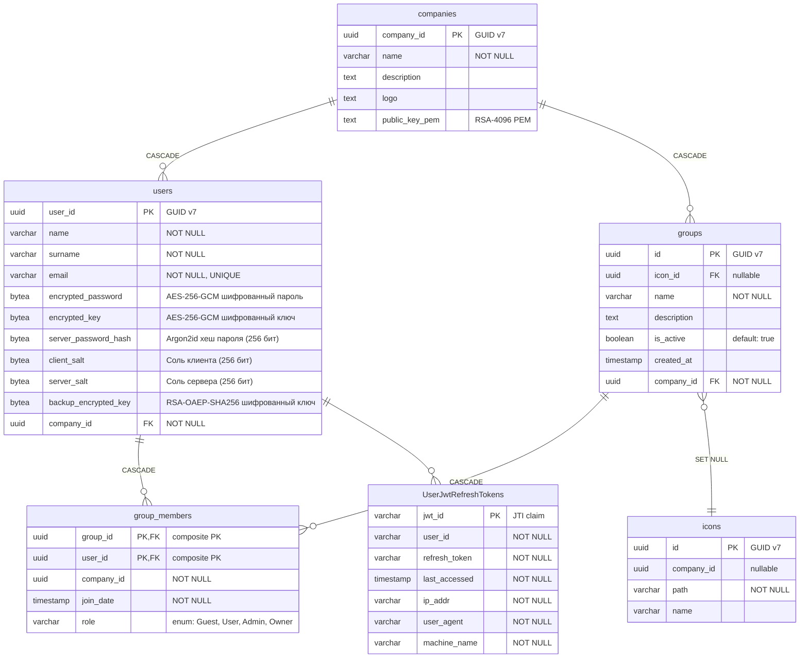
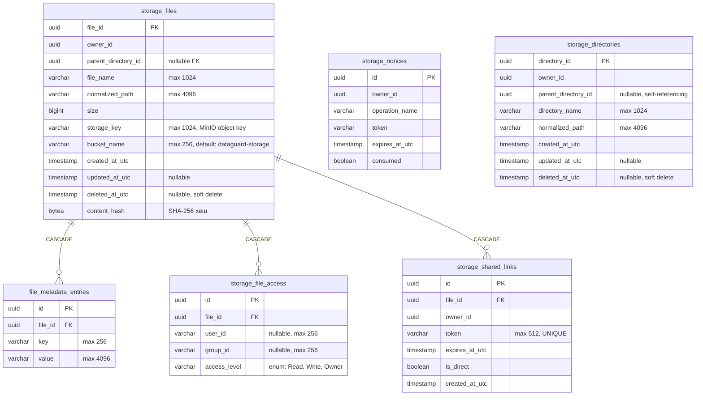

# Слой данных и инфраструктура

## 1. Обзор

DataGuard использует три типа хранилищ данных, каждое из которых выполняет строго определённую роль:

| Хранилище | Технология | Используется в | Назначение |
|:---|:---|:---|:---|
| Реляционная СУБД | PostgreSQL 18 | Server.Auth, Server.Storage | Персистентное хранение доменных сущностей |
| In-memory кэш | Redis 7+ | Server.Auth, Server.Storage | Nonce-токены, чёрный список JWT, данные регистрации |
| Blob-хранилище | MinIO S3 | Server.Storage | Физическое хранение файлов |
| Локальная СУБД | SQLite | Client.Engine | Локальное хранение Account и JwtToken |

ORM: **Entity Framework Core 10.0.9** с провайдером Npgsql. Конвенция именования столбцов — `snake_case` (пакет `EFCore.NamingConventions`).

---

## 2. Миграции

Миграции применяются через EF Core CLI:

```bash
# Создание миграции для Server.Auth
dotnet ef migrations add <НазваниеМиграции> \
  --project Server.Auth/Server.Auth.csproj \
  --startup-project Server.Auth/Server.Auth.csproj

# Применение миграции для Server.Auth
dotnet ef database update \
  --project Server.Auth/Server.Auth.csproj \
  --startup-project Server.Auth/Server.Auth.csproj

# Создание миграции для Server.Storage
dotnet ef migrations add <НазваниеМиграции> \
  --project Server.Storage/Server.Storage.csproj \
  --startup-project Server.Storage/Server.Storage.csproj

# Применение миграции для Server.Storage
dotnet ef database update \
  --project Server.Storage/Server.Storage.csproj \
  --startup-project Server.Storage/Server.Storage.csproj
```

### Существующие миграции Server.Auth

| Миграция | Описание |
|:---|:---|
| `20260606213152_InitialCreate` | Начальная схема: User, Company, Group, GroupMember, Icon |
| `20260611194746_Alpha0.0.1` | Обновление схемы (предварительная версия) |
| `20260611231720_PinToPassword` | Замена PIN на пароль (полная переработка аутентификации) |
| `20260613230423_AddPublicKeyPem` | Добавление поля `PublicKeyPem` в `Company` |

### Существующая миграция Server.Storage

| Миграция | Описание |
|:---|:---|
| `20260614103452_InitialStorage` | Начальная схема: StorageFile, StorageDirectory, FileMetadataEntry, StorageFileAccess, StorageSharedLink, StorageNonce |

---

## 3. Схема данных Server.Auth (PostgreSQL, схема `identity`)



### 3.1. Пользователь (User)

Таблица: `identity.users`

Сервер хранит данные пользователя в зашифрованном виде. Пароль, symmetric key и резервный ключ шифруются на стороне клиента перед передачей:

| Поле | Тип | Описание |
|:---|:---|:---|
| `user_id` | `uuid` (PK, GUID v7) | Уникальный идентификатор пользователя |
| `name` | `varchar` | Имя пользователя |
| `surname` | `varchar` | Фамилия пользователя |
| `email` | `varchar` (UNIQUE) | Электронная почта |
| `encrypted_password` | `bytea` | Пароль, зашифрованный AES-256-GCM (nonce 12 байт + tag 16 байт + ciphertext 64 байт = 92 байта) |
| `encrypted_key` | `bytea` | Symmetric key (256 бит), зашифрованный AES-256-GCM с ключом, производным от пароля (PBKDF2) |
| `server_password_hash` | `bytea` | Argon2id-хеш пароля (256 бит). Сравнение выполняется через `FixedTimeEquals` |
| `client_salt` | `bytea` | Соль, генерируемая на клиенте (256 бит). Используется для Argon2id |
| `server_salt` | `bytea` | Соль, генерируемая на сервере (256 бит). Резервная, не используется в текущей версии |
| `backup_encrypted_key` | `bytea` (nullable) | Symmetric key, зашифрованный публичным RSA-ключом компании (4096 бит) |
| `company_id` | `uuid` (FK) | Идентификатор компании |

### 3.2. Компания (Company)

Таблица: `identity.companies`

| Поле | Тип | Описание |
|:---|:---|:---|
| `company_id` | `uuid` (PK, GUID v7) | Уникальный идентификатор |
| `name` | `varchar` | Название компании |
| `description` | `text` (nullable) | Описание |
| `logo` | `text` (nullable) | Логотип (путь к файлу) |
| `public_key_pem` | `text` (nullable) | RSA-4096 публичный ключ в формате PEM. Устанавливается первым зарегистрированным пользователем |

### 3.3. Группы и роли (Group, GroupMember, GroupRole)

Таблица: `identity.groups`

| Поле | Тип | Описание |
|:---|:---|:---|
| `id` | `uuid` (PK, GUID v7) | Уникальный идентификатор группы |
| `icon_id` | `uuid` (FK, nullable) | Иконка группы |
| `name` | `varchar` | Название (например, `system:owner`) |
| `description` | `text` | Описание |
| `is_active` | `boolean` | Флаг активности |
| `created_at` | `timestamp` | Дата создания |
| `company_id` | `uuid` (FK) | Принадлежность компании |

Таблица: `identity.group_members`

Составной первичный ключ: `(group_id, user_id)`.

| Поле | Тип | Описание |
|:---|:---|:---|
| `group_id` | `uuid` (PK, FK) | Ссылка на группу |
| `user_id` | `uuid` (PK, FK) | Ссылка на пользователя |
| `company_id` | `uuid` | Идентификатор компании |
| `join_date` | `timestamp` | Дата вступления |
| `role` | `varchar` | Роль (enum `GroupRole`, хранится как строка) |

Перечисление `GroupRole`:

| Значение | Описание |
|:---|:---|
| `Guest` | Только чтение |
| `User` | Чтение и запись |
| `Admin` | Чтение, запись, управление пользователями в группе |
| `Owner` | Чтение, запись, управление пользователями и настройками |

Каскадное удаление: при удалении группы или пользователя удаляются все связанные записи `group_members`.

### 3.4. Refresh-токены (UserJwt)

Таблица: `identity.UserJwtRefreshTokens`

| Поле | Тип | Описание |
|:---|:---|:---|
| `jwt_id` | `varchar` (PK) | Значение `jti` (JWT ID) claim |
| `user_id` | `varchar` | Идентификатор пользователя |
| `refresh_token` | `varchar` | Тело refresh-токена |
| `last_accessed` | `timestamp` | Дата последнего использования |
| `ip_addr` | `varchar` | IP-адрес клиента |
| `user_agent` | `varchar` | User-Agent заголовок |
| `machine_name` | `varchar` | Имя машины клиента |

Отзыв refresh-токена выполняется путём удаления записи из таблицы. Проверка — через `FindAsync(jwtId)`.

---

## 4. Схема данных Server.Storage (PostgreSQL, схема `public`)



### 4.1. Файлы (StorageFile)

Таблица: `storage_files`

| Поле | Тип | Ограничения | Описание |
|:---|:---|:---|:---|
| `file_id` | `uuid` | PK, INDEX | GUID файла |
| `owner_id` | `uuid` | NOT NULL, INDEX (совм. с `normalized_path`) | Владелец (извлекается из JWT `sub`) |
| `parent_directory_id` | `uuid` | nullable FK | Родительская директория |
| `file_name` | `varchar(1024)` | NOT NULL | Имя файла |
| `normalized_path` | `varchar(4096)` | NOT NULL | Нормализованный путь директории |
| `size` | `bigint` | | Размер файла в байтах (макс. 5 ГБ) |
| `storage_key` | `varchar(1024)` | NOT NULL | Ключ объекта в MinIO |
| `bucket_name` | `varchar(256)` | NOT NULL, default `dataguard-storage` | Имя бакета в MinIO |
| `created_at_utc` | `timestamp` | | Дата создания |
| `updated_at_utc` | `timestamp` | nullable | Дата последнего обновления |
| `deleted_at_utc` | `timestamp` | nullable | **Мягкое удаление**. Если не null — файл считается удалённым |
| `content_hash` | `bytea` | nullable | SHA-256 хеш содержимого |

**Глобальный query filter:** `WHERE deleted_at_utc IS NULL` — удалённые файлы исключаются из всех запросов.

### 4.2. Директории (StorageDirectory)

Таблица: `storage_directories`

Аналогична `storage_files`, но без blob-данных. Поддерживает иерархию через `parent_directory_id` (самоссылающийся FK).

### 4.3. Метаданные (FileMetadataEntry)

Таблица: `file_metadata_entries`

Пользовательские метаданные файла в формате «ключ-значение». Каскадно удаляются при удалении файла.

Ограничения при обновлении:
- Максимум 64 записи на файл
- Максимальная длина ключа — 256 символов
- Максимальная длина значения — 4096 символов
- Запрещённые ключи: `storageKey`, `ownerId`, `physicalPath`, `bucketName`, а также все ключи, начинающиеся с `__`

### 4.4. Доступ к файлам (StorageFileAccess)

Таблица: `storage_file_access`

| Уровень доступа | Описание |
|:---|:---|
| `Read` | Чтение |
| `Write` | Запись |
| `Owner` | Полный доступ |

### 4.5. Общие ссылки (StorageSharedLink)

Таблица: `storage_shared_links`

Два типа ссылок:
- **Обычная** (`is_direct = false`): открывает файл в приложении, URL: `/storage/links/{token}`
- **Прямая** (`is_direct = true`): прямое скачивание, URL: `/storage/direct/{token}`

TTL ссылки: от 1 до 2 592 000 секунд (30 дней). Токен генерируется через Nanoid.

---

## 5. Redis

### 5.1. Server.Auth

| Префикс ключа | Формат | TTL | Назначение |
|:---|:---|:---|:---|
| `auth:` | `auth:{registration_code}` | 30 дней | Данные регистрации (сериализованный JSON `RegistrationData`) |
| `jwt:` | `jwt:blacklist:{jti}` | Оставшееся время жизни токена | Чёрный список access-токенов |
| `security:` | `security:nonce:{guid}` | 5 минут | Nonce-токены аутентификации |

### 5.2. Server.Storage

| Префикс ключа | Формат | TTL | Назначение |
|:---|:---|:---|:---|
| (нет) | `{nonce_token}` | 5 минут | Nonce-токены для защиты от повторных атак |

---

## 6. MinIO S3

### 6.1. Конфигурация

| Параметр | Значение по умолчанию | Источник |
|:---|:---|:---|
| Endpoint | `localhost:9000` | `appsettings.json` → `Minio:Endpoint` |
| AccessKey | — | Переменная окружения `MINIO_ROOT_USER` |
| SecretKey | — | Переменная окружения `MINIO_ROOT_PASSWORD` |
| Bucket | `dataguard-storage` | Захардкожено в модели `StorageFile` |
| SSL | `false` | Конфигурация в `Program.cs` |

### 6.2. Операции

| Операция | Метод MinIO SDK | Условие |
|:---|:---|:---|
| Загрузка | `PutObjectAsync` | Чанки ≤ 1 МБ, собираются через `ComposeObjectAsync` |
| Скачивание | `GetObjectAsync` | Стриминг чанками по 256 КБ |
| Копирование | `CopyObjectAsync` | Создаёт новый объект |
| Удаление | Не выполняется | При soft delete blob остаётся в MinIO |

---

## 7. Локальная база данных Client.Engine (SQLite)

Таблица: `Accounts`

| Поле | Тип | Описание |
|:---|:---|:---|
| `AccountId` | `Guid` | Идентификатор учётной записи (соответствует `User.UserId`) |
| `Email` | `string` | Электронная почта |
| `JwtToken` | `JwtToken` | Навигационное свойство → JwtToken |

Таблица: `JwtTokens`

| Поле | Тип | Описание |
|:---|:---|:---|
| `AccessToken` | `string` | JWT access-токен |
| `RefreshToken` | `string` | JWT refresh-токен |
| `AccountId` | `Guid` | Идентификатор учётной записи |
| `Account` | `Account` | Навигационное свойство |

Файл базы данных: `%LOCALAPPDATA%/DataGuard/Agent/Agent.db`. Создаётся автоматически при запуске через `db.Database.EnsureCreated()`.