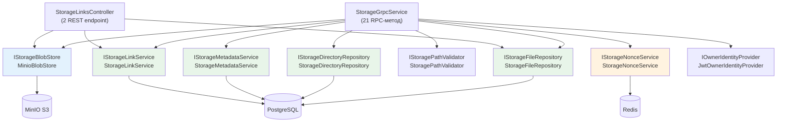

# Server.Storage — Сервис файлового хранилища

## Обзор

**Server.Storage** — ASP.NET Core сервис (.NET 10), предоставляющий gRPC и REST API для управления файлами, директориями, метаданными и ссылками. Физическое хранение файлов осуществляется в MinIO S3, метаданные — в PostgreSQL.

**Технологии:**
- ASP.NET Core gRPC 2.80.0 (21 gRPC-метод)
- ASP.NET Core REST (2 endpoint: скачивание по ссылкам)
- Minio SDK 7.0.0 (blob-хранилище)
- Entity Framework Core 10.0.9 + PostgreSQL 18 (Npgsql)
- StackExchange.Redis 3.0.0 (nonce-защита)
- Microsoft.AspNetCore.Authentication.JwtBearer 10.0.9 (аутентификация)

**Порт:** `:8081` (HTTPS)

---

## Конфигурация

### appsettings.json

| Секция | Ключ | Значение по умолчанию | Описание |
|:---|:---|:---|:---|
| `ConnectionStrings` | `PostgresConnection` | — | Строка подключения к PostgreSQL (база `dataguard_storage`) |
| `ConnectionStrings` | `RedisConnection` | — | Строка подключения к Redis |
| `Minio` | `Endpoint` | `localhost:9000` | Адрес MinIO S3 API |
| `Minio` | `AccessKey` | — | Ключ доступа (env var `MINIO_ROOT_USER`) |
| `Minio` | `SecretKey` | — | Секретный ключ (env var `MINIO_ROOT_PASSWORD`) |
| `Jwt` | `Secret` | — | Секрет подписи JWT (env var `JWT_SECRET`) |
| `Jwt` | `Issuer` | `DataGuard` | Ожидаемый издатель JWT |
| `Jwt` | `Audience` | `DataGuard.Storage` | Ожидаемый получатель JWT |

**Требуемые переменные окружения:** `DB_USER`, `DB_PASSWORD`, `REDIS_PASSWORD`, `MINIO_ROOT_USER`, `MINIO_ROOT_PASSWORD`, `JWT_SECRET`

### Ограничения

| Параметр | Значение | Описание |
|:---|:---|:---|
| Максимальный размер чанка (upload) | 1 МБ | Ограничение `MaxChunkSize` в `StorageGrpcService` |
| Максимальный размер файла | 5 ГБ | `MaxFileSize = 5L * 1024 * 1024 * 1024` |
| Размер чанка при стриминге (download) | 256 КБ | `ChunkSize` в `StorageGrpcService` |
| TTL nonce | 5 минут | `StorageNonceService` |
| Максимальный TTL ссылки | 30 дней (2 592 000 с) | `StorageLinkService.MaxLinkTtlDays` |
| Бакет по умолчанию | `dataguard-storage` | Константа `DefaultBucket` |

---

## Аутентификация

Server.Storage использует стандартный ASP.NET Core JWT Bearer middleware. В отличие от Server.Auth (где применяется собственный `JwtMiddleware`), здесь применяется встроенная схема `JwtBearerDefaults.AuthenticationScheme`.

Идентификация текущего пользователя выполняется через `IOwnerIdentityProvider` (реализация — `JwtOwnerIdentityProvider`), который извлекает GUID из claim `sub` (subject) JWT-токена.

```csharp
// Проверка в каждом методе:
var ownerId = _ownerProvider.GetOwnerId(context.GetHttpContext());
if (ownerId == null)
    return new Response { Success = false, Message = "Не удалось идентифицировать пользователя." };
```

---

## Архитектура сервисного слоя



| Интерфейс | Реализация | Область видимости (DI) | Назначение |
|:---|:---|:---|:---|
| `IStorageFileRepository` | `StorageFileRepository` | Scoped | CRUD-операции с файлами (PostgreSQL) |
| `IStorageDirectoryRepository` | `StorageDirectoryRepository` | Scoped | CRUD-операции с директориями (PostgreSQL) |
| `IStorageBlobStore` | `MinioBlobStore` | Singleton | Чтение/запись blob в MinIO S3 |
| `IStorageNonceService` | `StorageNonceService` | Singleton | Генерация и верификация nonce (Redis) |
| `IStoragePathValidator` | `StoragePathValidator` | Singleton | Нормализация и валидация путей |
| `IStorageMetadataService` | `StorageMetadataService` | Scoped | Управление метаданными файлов |
| `IStorageLinkService` | `StorageLinkService` | Scoped | Генерация и валидация ссылок |
| `IOwnerIdentityProvider` | `JwtOwnerIdentityProvider` | Scoped | Извлечение `sub` из JWT |

---

## gRPC API

**Контракт:** `Contracts/Protos/storage.proto`

Все методы возвращают ответ с полями `success` (bool) и `message` (string). Методы, изменяющие данные, требуют параметр `nonce_token` — уникальное одноразовое значение для защиты от повторных атак.

### Операции с файлами

#### UploadFile

**RPC:** `UploadFile (stream UploadFileRequest) returns (UploadFileResponse)`

Серверный стриминг. Первое сообщение должно содержать `metadata`, последующие — `chunk`.

**Формат сообщений:**

```protobuf
message UploadFileRequest {
  oneof data {
    FileMetadata metadata = 1;  // Первое сообщение
    bytes chunk = 2;            // Последующие сообщения
  }
}

message FileMetadata {
  string file_name;       // Без / и \
  string file_path;       // Например, "docs/projects" или "/" для корня
  int64 size;             // Размер файла в байтах
  map<string, string> Metadata = 5;  // Пользовательские метаданные (опционально)
}
```

**Ответ:**

| Поле | Тип | Описание |
|:---|:---|:---|
| `success` | bool | Успешность операции |
| `message` | string | Текстовое описание |
| `file_id` | string | GUID созданного файла |

**Логика:**
1. Идентификация пользователя через JWT
2. Чтение метаданных из первого сообщения
3. Валидация имени файла (не пустое, без разделителей пути)
4. Нормализация пути через `IStoragePathValidator`
5. Определение родительской директории
6. Приём чанков (≤ 1 МБ), запись в MinIO через временные объекты
7. Сборка чанков через `ComposeObjectAsync` (MinIO)
8. Создание записи `StorageFile` в PostgreSQL
9. Сохранение пользовательских метаданных

**Требует nonce:** Нет (данные загружаются единоразово через стриминг)

---

#### GetFile

**RPC:** `GetFile (GetFileRequest) returns (stream GetFileResponse)`

Клиентский стриминг. Первый сообщение содержит `metadata`, последующие — `chunk`.

**Запрос:**

| Поле | Тип | Описание |
|:---|:---|:---|
| `file_id` | string | GUID файла |

**Логика:**
1. Поиск файла в PostgreSQL (с проверкой `owner_id`)
2. Загрузка blob из MinIO
3. Отправка метаданных в первом сообщении
4. Стриминг данных чанками по 256 КБ

**Требует nonce:** Нет

---

#### UpdateFile

**RPC:** `UpdateFile (UpdateFileRequest) returns (UpdateFileResponse)`

Частичное обновление содержимого файла.

**Запрос:**

```protobuf
message UpdateFileRequest {
  oneof data {
    int64 file_id = 1;        // Первое сообщение: идентификатор файла
    UpdateOperation update = 2;  // Запись данных по смещению
    ErraseOperation erase = 3;   // Запись нулей по смещению
  }
  string nonce_token = 4;      // Nonce-токен (в каждом сообщении)
}

message UpdateOperation {
  int64 offset;  // Смещение в байтах (≥ 0)
  bytes data;    // Данные для записи
}

message ErraseOperation {
  int64 offset;  // Смещение в байтах
  int64 size;    // Размер стираемого блока
}
```

**Требует nonce:** Да

---

#### DeleteFile

**RPC:** `DeleteFile (DeleteFileRequest) returns (DeleteFileResponse)`

Мягкое удаление файла (soft delete). Blob в MinIO **не удаляется** — устанавливается `DeletedAtUtc` в PostgreSQL. Глобальный query filter автоматически исключает удалённые файлы из всех запросов.

**Запрос:**

| Поле | Тип | Описание |
|:---|:---|:---|
| `file_id` | string | GUID файла |
| `nonce_token` | string | Nonce-токен |

**Требует nonce:** Да

---

#### MoveFile

**RPC:** `MoveFile (MoveFileRequest) returns (MoveFileResponse)`

Перемещение файла в другую директорию. Обновляет `normalized_path` и `parent_directory_id`. Blob в MinIO **не перемещается**.

**Запрос:**

| Поле | Тип | Описание |
|:---|:---|:---|
| `file_id` | string | GUID файла |
| `new_path` | string | Новый путь директории (например, `docs/archive`) |
| `nonce_token` | string | Nonce-токен |

**Требует nonce:** Да

---

#### CopyFile

**RPC:** `CopyFile (CopyFileRequest) returns (CopyFileResponse)`

Полное копирование файла. Создаёт новый blob в MinIO через `CopyObjectAsync` и новую запись в PostgreSQL.

**Запрос:**

| Поле | Тип | Описание |
|:---|:---|:---|
| `file_id` | string | GUID исходного файла |
| `new_path` | string | Путь директории назначения |
| `nonce_token` | string | Nonce-токен |

**Ответ:**

| Поле | Тип | Описание |
|:---|:---|:---|
| `new_file_id` | string | GUID нового файла |

**Требует nonce:** Да

---

#### RenameFile

**RPC:** `RenameFile (RenameFileRequest) returns (RenameFileResponse)`

Переименование файла. Обновляет `file_name` в PostgreSQL. Blob в MinIO **не изменяется**.

**Запрос:**

| Поле | Тип | Описание |
|:---|:---|:---|
| `file_id` | string | GUID файла |
| `new_name` | string | Новое имя (без `/` и `\`) |
| `nonce_token` | string | Nonce-токен |

**Требует nonce:** Да

---

### Операции с директориями

#### NewDirectory

**RPC:** `NewDirectory (NewDirectoryRequest) returns (NewDirectoryResponse)`

Создание новой директории. Родительская директория должна существовать.

**Запрос:**

| Поле | Тип | Описание |
|:---|:---|:---|
| `directory_path` | string | Полный путь новой директории (например, `docs/projects/2024`) |

**Ответ:**

| Поле | Тип | Описание |
|:---|:---|:---|
| `directory_id` | string | GUID созданной директории |

**Требует nonce:** Нет

---

#### RenameDirectory

**RPC:** `RenameDirectory (RenameDirectoryRequest) returns (RenameDirectoryResponse)`

Переименование директории. Рекурсивно обновляет `normalized_path` у всех вложенных файлов и поддиректорий.

**Запрос:**

| Поле | Тип | Описание |
|:---|:---|:---|
| `directory_id` | string | GUID директории |
| `new_name` | string | Новое имя директории |
| `nonce_token` | string | Nonce-токен |

**Требует nonce:** Да

---

#### DeleteDirectory

**RPC:** `DeleteDirectory (DeleteDirectoryRequest) returns (DeleteDirectoryResponse)`

Мягкое удаление директории (soft delete).

**Запрос:**

| Поле | Тип | Описание |
|:---|:---|:---|
| `directory_id` | string | GUID директории |
| `recursive` | bool | `true` — рекурсивное удаление всех вложенных объектов; `false` — только пустая директория |
| `nonce_token` | string | Nonce-токен |

**Требует nonce:** Да

---

#### MoveDirectory

**RPC:** `MoveDirectory (MoveDirectoryRequest) returns (MoveDirectoryResponse)`

Перемещение директории. Запрещает перемещение внутрь себя (проверка циклических зависимостей). Рекурсивно обновляет `normalized_path`.

**Запрос:**

| Поле | Тип | Описание |
|:---|:---|:---|
| `directory_id` | string | GUID директории |
| `new_path` | string | Новый путь |
| `nonce_token` | string | Nonce-токен |

**Требует nonce:** Да

---

#### CopyDirectory

**RPC:** `CopyDirectory (CopyDirectoryRequest) returns (CopyDirectoryResponse)`

Копирование директории. При `recursive = true` — рекурсивно копирует все вложенные файлы (создаёт новые blob в MinIO).

**Запрос:**

| Поле | Тип | Описание |
|:---|:---|:---|
| `directory_id` | string | GUID исходной директории |
| `new_path` | string | Путь директории назначения |
| `recursive` | bool | Рекурсивное копирование |
| `nonce_token` | string | Nonce-токен |

**Ответ:**

| Поле | Тип | Описание |
|:---|:---|:---|
| `new_directory_id` | string | GUID новой директории |

**Требует nonce:** Да

---

### Операции с метаданными

#### GetMetadata

**RPC:** `GetMetadata (GetMetadataRequest) returns (GetMetadataResponse)`

Получение метаданных файла. Не возвращает системные поля (`storageKey`, `bucketName`, `ownerId`).

**Запрос:**

| Поле | Тип | Описание |
|:---|:---|:---|
| `file_id` | string | GUID файла |

**Ответ:**

| Поле | Тип | Описание |
|:---|:---|:---|
| `metadata` | FileMetadata | Метаданные файла (имя, путь, размер, пользовательские метаданные) |

**Требует nonce:** Нет

---

#### UpdateMetadata

**RPC:** `UpdateMetadata (UpdateMetadataRequest) returns (UpdateMetadataResponse)`

**Полная замена** метаданных файла. Все существующие записи удаляются, затем создаются новые.

**Запрос:**

| Поле | Тип | Описание |
|:---|:---|:---|
| `file_id` | string | GUID файла |
| `metadata` | map<string, string> | Новые метаданные (полная замена) |

**Ограничения:**
- Максимум 64 записи
- Максимальная длина ключа — 256 символов
- Максимальная длина значения — 4096 символов
- Запрещённые ключи: `storageKey`, `ownerId`, `physicalPath`, `bucketName`, а также все ключи, начинающиеся с `__`

**Требует nonce:** Нет

---

### Операции со списками

#### ListDirectory

**RPC:** `ListDirectory (ListDirectoryRequest) returns (ListDirectoryResponse)`

Получение списка файлов в директории.

**Запрос:**

| Поле | Тип | Описание |
|:---|:---|:---|
| `directory_id` | string | GUID директории |
| `recursive` | bool | Включать ли вложенные файлы из поддиректорий |

**Ответ:**

| Поле | Тип | Описание |
|:---|:---|:---|
| `items` | repeated FileMetadata | Список файлов (поддиректории не включаются) |

**Требует nonce:** Нет

---

### Операции со ссылками

#### GenerateLink

**RPC:** `GenerateLink (GenerateLinkRequest) returns (GenerateLinkResponse)`

Генерация безопасной ссылки на файл. Обычная ссылка перенаправляет на прямую.

**Запрос:**

| Поле | Тип | Описание |
|:---|:---|:---|
| `file_id` | string | GUID файла |
| `groups` | repeated string | Список групп с доступом (опционально) |
| `users` | repeated string | Список пользователей с доступом (опционально) |
| `ttl_seconds` | int32 | Время жизни в секундах (1 — 2 592 000) |
| `nonce_token` | string | Nonce-токен |

**Ответ:**

| Поле | Тип | Описание |
|:---|:---|:---|
| `link` | string | Ссылка вида `/storage/links/{token}` |

**Требует nonce:** Да

---

#### GenerateDirectLink

**RPC:** `GenerateDirectLink (GenerateLinkRequest) returns (GenerateLinkResponse)`

Генерация прямой ссылки для скачивания файла.

**Запрос:** Аналогично `GenerateLink`.

**Ответ:**

| Поле | Тип | Описание |
|:---|:---|:---|
| `link` | string | Ссылка вида `/storage/direct/{token}` |

**Требует nonce:** Да

---

## REST API

### Скачивание по обычной ссылке

```
GET /storage/links/{token}
```

**Аутентификация:** Не требуется.

**Ответы:**

| Код | Описание |
|:---|:---|
| 307 | Перенаправление на `/storage/direct/{token}` |
| 404 | Ссылка не найдена |
| 410 | Ссылка истекла |

---

### Скачивание по прямой ссылке

```
GET /storage/direct/{token}
```

**Аутентификация:** Не требуется.

**Ответы:**

| Код | Content-Type | Описание |
|:---|:---|:---|
| 200 | `application/octet-stream` | Потоковое содержимое файла |
| 404 | — | Ссылка или файл не найдены |
| 410 | — | Ссылка истекла |
| 500 | — | Ошибка при загрузке из MinIO |

---

## Nonce-защита

Все изменяющие операции (upload, delete, move, copy, rename, update, generate link) требуют `nonce_token`.

**Формат nonce-токена:** уникальная строка, генерируемая клиентом (например, GUID). Сервер проверяет уникальность через Redis с использованием атомарной операции `SET ... NX` (только если ключ не существует).

**Ключ в Redis:** `nonce:{ownerId}:{operationName}:{nonceToken}`

**TTL:** 5 минут (одноразовое использование — при успешной операции nonce помечается как потреблённый и не может быть переиспользован).

---

## Сводная таблица методов

| Метод | Тип | Стриминг | Требует nonce | Требует JWT |
|:---|:---|:---|:---|:---|
| UploadFile | gRPC | Серверный (вход) | Нет | Да |
| GetFile | gRPC | Серверный (исход) | Нет | Да |
| UpdateFile | gRPC | Нет | Да | Да |
| DeleteFile | gRPC | Нет | Да | Да |
| MoveFile | gRPC | Нет | Да | Да |
| CopyFile | gRPC | Нет | Да | Да |
| RenameFile | gRPC | Нет | Да | Да |
| NewDirectory | gRPC | Нет | Нет | Да |
| RenameDirectory | gRPC | Нет | Да | Да |
| DeleteDirectory | gRPC | Нет | Да | Да |
| MoveDirectory | gRPC | Нет | Да | Да |
| CopyDirectory | gRPC | Нет | Да | Да |
| GetMetadata | gRPC | Нет | Нет | Да |
| UpdateMetadata | gRPC | Нет | Нет | Да |
| ListDirectory | gRPC | Нет | Нет | Да |
| GenerateLink | gRPC | Нет | Да | Да |
| GenerateDirectLink | gRPC | Нет | Да | Да |
| GET /storage/links/{token} | REST | Нет | Нет | Нет |
| GET /storage/direct/{token} | REST | Нет | Нет | Нет |